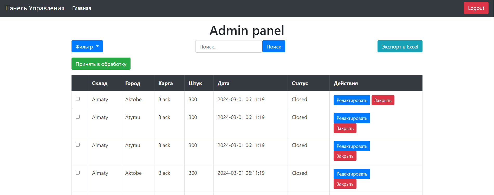

# Проект Admin Panel для курса One Lab
Этот проект представляет собой административную панель, разработанную на основе фреймворка Laravel. Административная панель предназначена для управления контентом сайта, в частности постами. Панель оснащена различными функциями, обеспечивающими удобное управление и обработку постов.

# Возможности
Аутентификация Администратора: Панель содержит систему входа и выхода для администратора, обеспечивая безопасный доступ к управлению сайтом.

Просмотр Дашборда: После аутентификации администратор получает доступ к дашборду, где отображается общая информация и статистика сайта.

Управление Постами:

Просмотр Постов: Администратор может просматривать список всех постов на сайте.

Редактирование Постов: Предоставляется возможность редактировать существующие посты, внося изменения в их содержание.

Экспорт Постов: Функционал экспорта позволяет администратору выгружать данные постов в Excel файлы.

Поиск Постов: Реализован поиск постов по различным критериям, упрощающий нахождение нужной информации.

Фильтрация Постов: Возможность фильтрации постов по заданным параметрам для более удобного управления контентом.

Обработка Постов: Администратор может обрабатывать посты, например, изменять их статус.

Закрытие Постов: Функция закрытия постов позволяет убирать их из активного доступа на сайте.

## "Clean Code" и лучшие практики

В разработке данной административной панели особое внимание уделялось соблюдению принципов "Чистого кода" и следованию лучшим практикам программирования. Это позволило создать эффективный, удобный в поддержке и расширяемый код, что является ключом к долгосрочному успеху любого программного проекта.

### Основные аспекты:

- **Модульность**: Логика экспорта данных и фильтрации была организована в отдельные классы и компоненты, что способствует легкой модификации и добавлению нового функционала.

- **DRY (Don't Repeat Yourself)**: Избегание дублирования кода путём вынесения повторяющейся логики в общедоступные методы или классы.

- **KISS (Keep It Simple, Stupid)**: Сложные операции были разбиты на более простые шаги, обеспечивая тем самым лучшую поддерживаемость и понимание кода.

- **YAGNI (You Ain't Gonna Need It)**: Функциональность реализовывалась с учётом текущих требований проекта, избегая предварительных оптимизаций и добавления неиспользуемого кода.

- **Принцип единственной ответственности (Single Responsibility Principle)**: Каждый класс и метод стремятся выполнять лишь одну задачу, что упрощает тестирование и поддержку.

### Инструменты и технологии:

Проект использует ряд современных инструментов и технологий, которые способствуют качественной разработке:

- **Laravel**: Фреймворк, обеспечивающий мощную основу для приложения и предоставляющий широкие возможности для реализации лучших практик.

- **Bootstrap**: Для создания привлекательного и адаптивного интерфейса.

- **Blade**: Шаблонизатор Laravel, облегчающий разработку динамических представлений.

# Начало работы

1. Клонировать репозиторий проекта на локальный компьютер.
2. Установить зависимости с помощью Composer: composer install.
3. Настроить файл окружения .env для подключения к базе данных.
4. Выполнить миграции базы данных: php artisan migrate.
5. Запустить выполнение Seed-ов php artisan db:seed
6. Запустить проект: php artisan serve.
