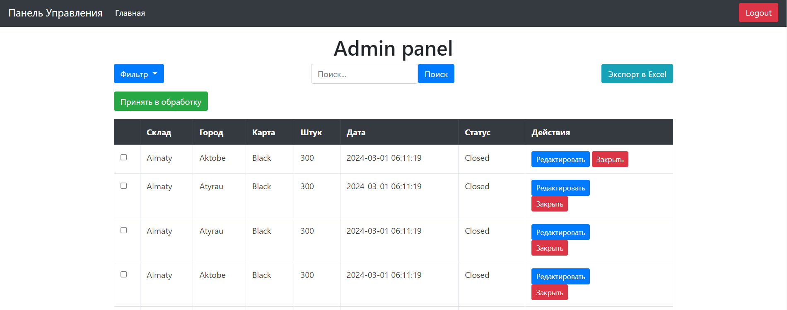

# Проект Admin Panel для курса One Lab
Этот проект представляет собой административную панель, разработанную на основе фреймворка Laravel. Административная панель предназначена для управления контентом сайта, в частности постами. Панель оснащена различными функциями, обеспечивающими удобное управление и обработку постов.

# Возможности
Аутентификация Администратора: Панель содержит систему входа и выхода для администратора, обеспечивая безопасный доступ к управлению сайтом.

Просмотр Дашборда: После аутентификации администратор получает доступ к дашборду, где отображается общая информация и статистика сайта.

Управление Постами:

Просмотр Постов: Администратор может просматривать список всех постов на сайте.

Редактирование Постов: Предоставляется возможность редактировать существующие посты, внося изменения в их содержание.

Экспорт Постов: Функционал экспорта позволяет администратору выгружать данные постов в Excel файлы.

Поиск Постов: Реализован поиск постов по различным критериям, упрощающий нахождение нужной информации.

Фильтрация Постов: Возможность фильтрации постов по заданным параметрам для более удобного управления контентом.

Обработка Постов: Администратор может обрабатывать посты, например, изменять их статус.

Закрытие Постов: Функция закрытия постов позволяет убирать их из активного доступа на сайте.

# Технологий

Проект разработан с использованием следующих технологий:

Laravel: Основной фреймворк, на котором построена административная панель.
Bootstrap: Фреймворк для стилизации интерфейса административной панели, делая ее визуально привлекательной и удобной для использования.
Blade: шаблонизатор, поставляемый с Laravel

# Начало работы

1. Клонировать репозиторий проекта на локальный компьютер.
2. Установить зависимости с помощью Composer: composer install.
3. Настроить файл окружения .env для подключения к базе данных.
4. Выполнить миграции базы данных: php artisan migrate.
5. Запустить выполнение Seed-ов php artisan db:seed
6. Запустить проект: php artisan serve.
